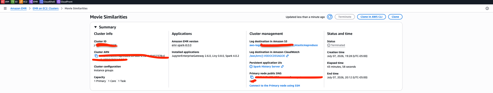
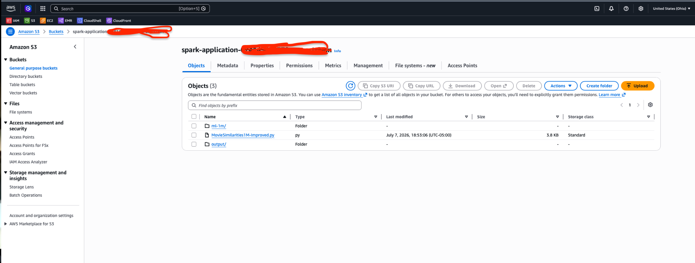
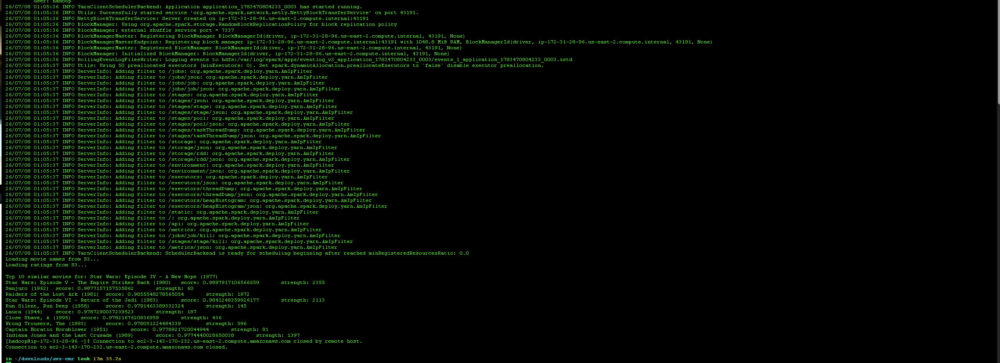

# Apache Spark & PySpark Solutions

A collection of hands-on Apache Spark and PySpark exercises completed
during my Data Engineering training.

The repository is organized by training day and covers RDDs, DataFrames,
Spark SQL operations, log analysis, graph processing, breadth-first
search, movie similarity analysis, and distributed Spark execution on
Amazon EMR.

------------------------------------------------------------------------

## Technologies

-   Python
-   PySpark
-   Apache Spark
-   Spark RDDs
-   Spark DataFrames
-   Amazon EMR
-   Amazon S3
-   AWS CLI
-   YARN
-   SSH

------------------------------------------------------------------------

## Repository Structure

``` text
Spark-Solutions/
├── Day3/
├── Day4/
├── Week2/
│   └── Day1/
├── MovieSimilarities1M-Improved.py
├── screenshots/
│   ├── emr-cluster.png
│   ├── s3-storage.png
│   └── movie-similarity-results.png
└── README.md
```

Exercises are organized by the day they were completed.

------------------------------------------------------------------------

# Featured Project: Distributed Movie Similarity Analysis

This project uses PySpark to calculate movie-to-movie similarities from
the MovieLens 1M dataset.

The Spark application was deployed to an Amazon EMR cluster, with the
dataset, application code, logs, and generated similarity results stored
in Amazon S3.

The application uses item-based collaborative filtering and cosine
similarity to identify movies with similar user-rating patterns.

## Architecture

``` text
MovieLens Dataset
        |
        v
    Amazon S3
        |
        v
    Amazon EMR
        |
        v
  Apache Spark / PySpark
        |
        v
Generate Unique Movie Pairs
        |
        v
Group Co-Rating Pairs
        |
        v
Calculate Cosine Similarity
        |
        v
Filter and Rank Results
        |
        +--------------------+
        |                    |
        v                    v
 Top 10 Results         Amazon S3 Output
```

------------------------------------------------------------------------

## How the Spark Pipeline Works

1.  Movie metadata and user ratings are loaded from Amazon S3.
2.  Ratings are transformed into `(userID, (movieID, rating))` pairs.
3.  Ratings are partitioned by user ID.
4.  A self-join creates pairs of movies rated by the same users.
5.  Duplicate movie combinations are removed.
6.  Rating pairs are grouped by movie pair.
7.  Cosine similarity is calculated for each movie pair.
8.  Results are filtered using similarity and co-occurrence thresholds.
9.  The top 10 strongest matches are returned for the selected movie.
10. The complete similarity dataset is written back to Amazon S3.

------------------------------------------------------------------------

## Spark Techniques Used

The project demonstrates several Spark concepts:

-   RDD transformations and actions
-   `map()` and `filter()`
-   `join()`
-   `groupByKey()`
-   `mapValues()`
-   `partitionBy()`
-   Broadcast variables
-   RDD persistence
-   Distributed sorting
-   Pair RDD processing
-   Cosine similarity
-   Spark execution on YARN

------------------------------------------------------------------------

## Amazon EMR Cluster

The PySpark application was executed on an Amazon EMR cluster running
Spark.

The cluster used Primary, Core, and Task node roles to execute the
distributed workload.



------------------------------------------------------------------------

## Amazon S3 Storage

Amazon S3 was used to store:

-   MovieLens input data
-   PySpark application code
-   Generated movie similarity results
-   EMR logs

The project storage structure separates the input dataset, Spark
application, and generated output.



------------------------------------------------------------------------

## Example Result

The application was executed to find movies with rating patterns similar
to:

**Star Wars: Episode IV - A New Hope (1977)**

  -----------------------------------------------------------------------
                Rank Movie            Similarity Score Co-Rating Strength
  ------------------ -------------- ------------------ ------------------
                   1 Star Wars:                 0.9898              2,355
                     Episode V -                       
                     The Empire                        
                     Strikes Back                      
                     (1980)                            

                   2 Sanjuro (1962)             0.9877                 60

                   3 Raiders of the             0.9856              1,972
                     Lost Ark                          
                     (1981)                            

                   4 Star Wars:                 0.9841              2,113
                     Episode VI -                      
                     Return of the                     
                     Jedi (1983)                       

                   5 Run Silent,                0.9791                145
                     Run Deep                          
                     (1958)                            

                   6 Laura (1944)               0.9787                187

                   7 A Close Shave              0.9782                436
                     (1995)                            

                   8 The Wrong                  0.9781                596
                     Trousers                          
                     (1993)                            

                   9 Captain                    0.9779                 81
                     Horatio                           
                     Hornblower                        
                     (1951)                            

                  10 Indiana Jones              0.9774              1,397
                     and the Last                      
                     Crusade (1989)                    
  -----------------------------------------------------------------------

### Spark Job Output



------------------------------------------------------------------------

## Understanding the Results

Each recommendation contains two important values:

### Similarity Score

The cosine similarity score measures how closely the rating patterns of
two movies align.

A score closer to `1.0` indicates stronger similarity between the
user-rating patterns.

### Co-Rating Strength

The strength value represents the number of users who rated both movies.

For example:

``` text
Star Wars: Episode V - The Empire Strikes Back (1980)

Similarity Score: 0.9898
Strength: 2355
```

This is a strong result because the movies have both a high similarity
score and a large number of users who rated both titles.

------------------------------------------------------------------------

## Running the Spark Application

The application accepts a MovieLens movie ID as a command-line argument.

Example:

``` bash
spark-submit MovieSimilarities1M-Improved.py 260
```

The application then:

1.  Calculates movie-pair similarities.
2.  Filters pairs related to the requested movie.
3.  Applies similarity and co-occurrence thresholds.
4.  Sorts the results.
5.  Returns the top 10 similar movies.

------------------------------------------------------------------------

## Other Spark Exercises

In addition to the EMR project, this repository contains exercises
covering:

-   RDD creation and transformations
-   `map()`, `flatMap()`, and `filter()`
-   `reduceByKey()` aggregation
-   Customer spending analysis
-   DataFrame transformations
-   Web server log analysis
-   Movie popularity analysis
-   Superhero connection analysis
-   Finding obscure superheroes
-   Breadth-first search
-   Degrees of separation in graph data
-   Spark partitioning and distributed execution

------------------------------------------------------------------------

## Key Learning Outcomes

Through these exercises and projects, I practiced:

-   Processing structured and unstructured datasets with Spark
-   Choosing between RDD and DataFrame APIs
-   Performing distributed aggregations
-   Understanding narrow and wide transformations
-   Working with Spark partitions and shuffle operations
-   Processing graph data with Spark RDDs
-   Implementing breadth-first search
-   Building a movie similarity pipeline
-   Running PySpark applications on Amazon EMR
-   Reading input data from Amazon S3
-   Writing distributed Spark output back to Amazon S3
-   Connecting to and working with cloud-based Spark clusters
