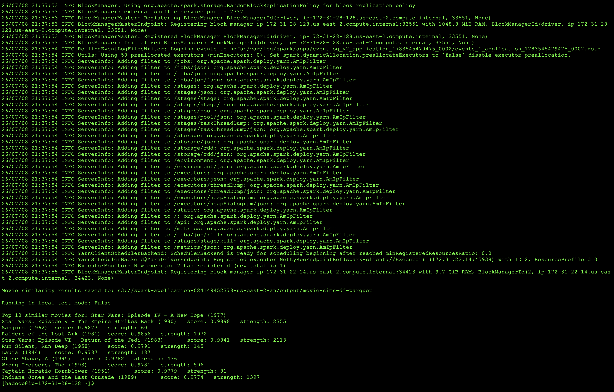

# Movie Similarities with Spark DataFrames and Parquet

This project refactors the original RDD-based MovieLens similarity program into a Spark DataFrame version.

The application calculates movie-to-movie similarities using the MovieLens 1M dataset, writes the full similarity results to Parquet, then reads the Parquet output back to find the top 10 movies similar to Star Wars: Episode IV - A New Hope (1977).

## Technologies Used

- Python
- PySpark
- Spark DataFrames
- Amazon EMR
- Amazon S3
- Parquet
- MovieLens 1M Dataset

## Dataset

This project uses the MovieLens 1M dataset.

Files used:

```text
ml-1m/
├── movies.dat
└── ratings.dat
```

Both files use `::` as the separator.

## What the Program Does

1. Reads movie metadata from `movies.dat`.
2. Reads user ratings from `ratings.dat`.
3. Creates movie pairs using a DataFrame self-join on `user_id`.
4. Removes duplicate and reversed movie pairs.
5. Groups movie pairs and calculates the components needed for cosine similarity.
6. Calculates a similarity score for each movie pair.
7. Saves the full movie-pair similarity results as Parquet.
8. Reads the Parquet output back into a DataFrame.
9. Filters and ranks the top 10 similar movies for a selected movie.

## Local Testing

The full MovieLens 1M self-join requires more memory than was available during local execution.

For local testing, the script uses a smaller subset of users:

```python
LOCAL_TEST_MODE = True
```

When local test mode is enabled, only ratings from the first 100 users are processed:

```python
ratings_df = ratings_df.filter(F.col("user_id") <= 100)
```

The local test uses a lower co-occurrence threshold:

```text
5
```

For the full Amazon EMR run, local test mode is disabled:

```python
LOCAL_TEST_MODE = False
```

The full run uses a co-occurrence threshold of:

```text
50
```

## Cosine Similarity

For each movie pair, the program calculates:

```text
sum_xy = Σ(rating_1 × rating_2)
sum_xx = Σ(rating_1²)
sum_yy = Σ(rating_2²)
num_pairs = number of users who rated both movies
```

The cosine similarity score is then calculated as:

```text
score = sum_xy / (sqrt(sum_xx) × sqrt(sum_yy))
```

## Parquet Output

The complete movie similarity results are written as Parquet:

```python
movie_pair_similarities.write \
    .mode("overwrite") \
    .parquet(OUTPUT_PATH)
```

The application then reads the Parquet output back into a DataFrame:

```python
similarities_df = spark.read.parquet(OUTPUT_PATH)
```

The final recommendation query runs against the DataFrame loaded from the Parquet output.

## Amazon EMR Execution

After successful local testing, the application was run on Amazon EMR using the complete MovieLens 1M dataset stored in Amazon S3.

The full EMR run:

- Reads the MovieLens 1M dataset from Amazon S3
- Processes the ratings using Spark DataFrames
- Performs the movie-rating self-join
- Calculates cosine similarity scores
- Saves the full similarity results to Amazon S3 as Parquet
- Reads the Parquet results back into a DataFrame
- Finds the top 10 similar movies

## Example Output

The application was run for:

**Star Wars: Episode IV - A New Hope (1977)**

```text
Top 10 similar movies for: Star Wars: Episode IV - A New Hope (1977)

Star Wars: Episode V - The Empire Strikes Back (1980)  score: 0.9897917106566659  strength: 2355
Sanjuro (1962)  score: 0.9877157157535862  strength: 60
Raiders of the Lost Ark (1981)  score: 0.9855548278565054  strength: 1972
Star Wars: Episode VI - Return of the Jedi (1983)  score: 0.9841248359926177  strength: 2113
Run Silent, Run Deep (1958)  score: 0.9791463389332324  strength: 145
Laura (1944)  score: 0.9787290037239523  strength: 187
Close Shave, A (1995)  score: 0.9782167620836959  strength: 436
Wrong Trousers, The (1993)  score: 0.978051224484339  strength: 596
Captain Horatio Hornblower (1951)  score: 0.9778921720044944  strength: 81
Indiana Jones and the Last Crusade (1989)  score: 0.9774440028650038  strength: 1397
```

## EMR Output Screenshot

The screenshot below shows the completed DataFrame application running on Amazon EMR with the full MovieLens 1M dataset.

It confirms that the movie similarity results were saved to Amazon S3 in Parquet format and that the application successfully returned the top 10 similar movies.



## Key Spark Concepts Practiced

- Spark DataFrames
- Explicit schemas
- DataFrame self-joins
- Column aliases
- Filtering duplicate movie pairs
- `groupBy()` and `agg()`
- Distributed aggregations
- Cosine similarity
- Spark SQL functions
- Multi-column sorting
- Writing Parquet files
- Reading Parquet files
- Local testing with reduced datasets
- Amazon EMR execution
- Amazon S3 input and output

## Key Takeaway

This project demonstrates how a movie similarity workflow can be implemented using Spark DataFrames, DataFrame joins, distributed aggregations, Spark SQL functions, and Parquet storage.

The application was tested locally on a smaller subset before processing the complete MovieLens 1M dataset on Amazon EMR.